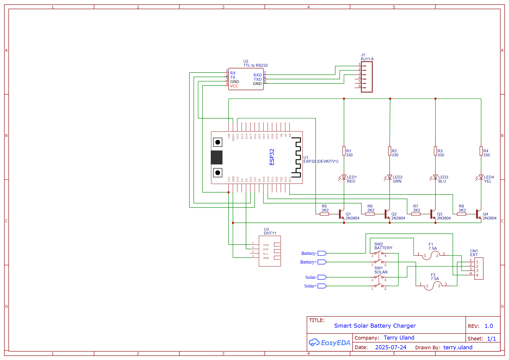

# Smart Solar Battery Charger
Portable solar battery charger that works with Home Assistant

This project extends the Renogy Wanderer Solar Charge Controller into a portable weather resistant smart battery charger that integrates into Home Assistant. In the YouTube video linked above I have documented this project start to finish, including:
- Testing the Wanderer
- Installing Home Assistant
- Installing ESPHome on an ESP32 microcontroller
- Interfacing with the Wanderer via RS-232
- Adding temp & humidity sensors and status LEDs
- Breadboard prototyping
- ESPHome YAML logic and coding
- Installation of the Wanderer into an enclosure with switches, connectors, and cables
- PCB protoboard layout, wire wrapping, and soldering
- Home Assistant Companion (mobile app) installation
- Notifications
- Field testing

## Sketch

*the pinnacle of my artistic ability*

## Schematic
_2025-09-20.pdf)

## Renogy Wanderer Interface
RS-232 Pinout
| Pin | Color  | Description   | CAT5 Color  |
|-----|--------| --------------|-------------|
|  1  | Blue   | Transmit      | Brown       |
|  2  | Green  | Receive       | Blue        |
|  3  | Grey   | Ground        | Brown/White |
|  4  | White  | Not Connected |             |
|  5  | Orange | +12 Volts     |             |
|  6  | Brown  | Not Connected |             |

Modbus Registers
| Address | Units       | Description              |
|---------|-------------|--------------------------|
| 0x100   | Percent     | Battery State of Charge  |
| 0x101   | Volts       | Battery Voltage          |
| 0x102   | Amps        | Battery Charging Amps    |
| 0x103   | Degrees (C) | Controller Temp          |
| 0x104   | Volts       | Load Voltage             |
| 0x105   | Amps        | Load Amps                |
| 0x106   | Watts       | Load Power               |
| 0x107   | Volts       | Solar Voltage            |
| 0x108   | Amps        | Solar Amps               |
| 0x109   | Watts       | Solar Power              |
| 0x120   | Integer     | Charging State           |
| 0x121   | Integer     | Error State              |
* All volts are expressed as tenths of a volt (multiply result by 0.1 to get volts)
* All amps are expressed as hundredths of an amp (multiply result by 0.01 to get amps)
* Controller Temp register (0x103) requires a bitmask of 0xFF00
* Charging State register (0x120) requires a bitmask of 0x00FF

Charging States
| Register Value | State          |
|----------------|----------------|
| 0       | Not Charging          |
| 1       | Charging              |
| 2       | Power Point Tracking  |
| 3       | Equalizing            |
| 4       | Boosting              |
| 5       | Floating              |
| 6       | Overpower             |

Error States
| Register Value | State                            |
|----------------|----------------------------------|
| 0              | Normal                           |
| 1              | Battery Over-Discharge           |
| 2              | Battery Over-Voltage             |
| 4              | Battery Under-Voltage            |
| 8              | Load Short Circuit               |
| 16             | Load Over-Power/Over-Current     |
| 32             | Controller Over-Temperature      |
| 64             | Ambient Over-Temperature         |
| 128            | Solar Over-Power                 |
| 256            | Solar Short Circuit              |
| 512            | Solar Over-Voltage               |
| 1024           | Solar Counter Current            |
| 2048           | Solar Working Point Over-Voltage |
| 4096           | Solar Reverse Connection         |
| 8192           | Anti-Reverse MOS Short Circuit   |
| 16384          | Charge MOS Short Circuit         |

[Full Renogy Modbus Protocol Document](ROVER_MODBUS.pdf)

## ESP32 Hardware and Software Configuration

Pin Usage
| Pin | Description               |  
|-----|---------------------------|
| 4   | DHT Data                  |
| 13  | Red (Charging) LED        |
| 16  | UART Receive              |
| 17  | UART Transmit             |
| 18  | Green (Charged) LED       |
| 19  | Blue (Wifi Connected) LED |
| 23  | Yellow (Error) LED)       |

[ESPHome Configuration (YAML)](solar-charge-controller.yaml)

## Bill of Materials

|	Description	                                                      | Link                                  | Cost     |
|-------------------------------------------------------------------|---------------------------------------|----------|
|	Renogy 100W 12 Volt Solar Panel	                                  |	https://www.amazon.com/dp/B07GF5JY35	|	 $ 79.99 |
|	Renogy Wanderer 10 Amp Charge Controller                          | https://www.amazon.com/dp/B07NPDWZJ7	|	 $ 26.99 |
|	220x170x110mm Clear Front Junction Box	                          |	https://www.amazon.com/dp/B0828387BM	|	 $ 23.39 |
|	3 Pack ESP-WROOM-32 Devkit	                                      |	https://www.amazon.com/dp/B08D5ZD528	|	 $ 15.99 |
|	3 Pack TTL to RS232 Module	                                      |	https://www.amazon.com/dp/B091TN2ZPY	|	 $ 9.99  |
|	5 Pack DHT11 Module	                                              |	https://www.amazon.com/dp/B01DKC2GQ0	|	 $ 9.99  |
|	M20 4 Pin 300V 20A Connector	                                    |	https://www.amazon.com/dp/B0CYSQBDVV	|	 $ 17.99 |
|	2 Pack 15A DPST Toggle Switch	                                    |	https://www.amazon.com/dp/B0CMLB6W73	|	 $ 8.92  |
|	Right Angle Micro USB Cable	                                      |	https://www.amazon.com/dp/B00S8GU03A	|	 $ 7.99  |
|	10 Sets 3-Pin (3 Pole) Right Angle Screw Terminal Block Connector	|	https://www.amazon.com/dp/B07SVNGBZ7	|	 $ 7.91  |
|	10 Pack 6x8cm Protoboard                                          |	https://www.amazon.com/dp/B08WJD7HZ5	|	 $ 11.99 |
|	Red/Green/Blue/Yellow/White 100 pcs LED Kit	                      |	https://www.amazon.com/dp/B086V2M2TT	|	 $ 5.95  |
|	1350 pcs Resistor Kit 1%	                                        |	https://www.amazon.com/dp/B07P3MFG5D/	|	 $ 12.99 |
|	200 pcs 2N394 NPN Transistor	                                    |	https://www.amazon.com/dp/B07T4ZJ76B/	|	 $ 6.99  |
|	10 Pack 14AWG ATC Fuse Holder	                                    |	https://www.amazon.com/dp/B07426WCLM	|	 $ 7.95  |
|	10 Pack 50A Alligator Clips	                                      |	https://www.amazon.com/dp/B0773JXZT9	|	 $ 6.40  |
|	5 Pack MC4 Connector Pairs	                                      |	https://www.amazon.com/dp/B073TX1N5Q	|	 $ 9.99  |
|	20 Pack 6P6C RJ11 Connector	                                      |	https://www.amazon.com/dp/B07YZ7WHFB	|	 $ 5.79  |
|	5 Pack ATC 7.5 Amp Fuse	                                          |	https://www.amazon.com/dp/B000G7ALHE	|	 $ 4.98  |
|	14 AWG Silicone Wire Red & Black 25ft	                            |	https://www.amazon.com/dp/B07FMTCHC1	|	 $ 17.49 |
|	150 pcs Red 22-16 AWG Heat Shrink #6 Ring Terminal	              |	https://www.amazon.com/dp/B08BLLNH6Q	|	 $ 21.99 |
|	M2 Standoff Kit	                                                  |	https://www.amazon.com/dp/B0CB89SWW6	|	 $ 9.99  |

- Solder
- ~1ft of CAT5/6/etc
- Wrapping Wire
- Two 1/2" #4 Wood Screws
- Pin Headers

## Tools Required
- Wire Stripper/Crimper
- Heat Gun 
- MC4 Crimper
- RJ11 Crimper
- Soldering Iron
- Wire Cutters
- Small Flathead Screwdriver
- Small Phillips Screwdriver
- Helping Hands
- Drill
- 3/4" Bit
- 1/8" Bit
- Clamps
- Wire Wrapper
- Computer to run Home Assistant
- Breadboard
- Cat5/6 Stripper

## Links and Resources

[Home Assistant](https://home-assistant.io)

[ESPHome](https://esphome.io)

[ESPHome Web](https://web.esphome.io)

[CP2102 Drivers](https://www.silabs.com/products/development-tools/software/usb-to-uart-bridge-vcp-drivers)

[ESP32 Pinout Reference Guide](https://randomnerdtutorials.com/esp32-pinout-reference-gpios/)

[DigiKey LED Series Resistor Calculator](https://www.digikey.com/en/resources/conversion-calculators/conversion-calculator-led-series-resistor)

[Transistor Base Resistor Calculator](https://kaizerpowerelectronics.dk/calculators/transistor-base-resistor-calculator/)

